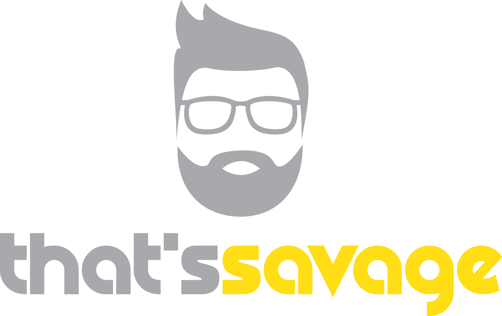

<a href="https://thatssavage.ie/" style="text-decoration: none; color: white">
That's Savage
</a> specialise in high quality, custom print garments and logo design. With over 10 years experience in design and garment printing, we are confident that we can supply a tailor made print to your liking. There are no minimum order requirements meaning that we can print special one off garments while also catering for much larger orders.

## Development

- `npm start`: Local development on server http://localhost:5173/.
- `npm run deploy`: Uses gh-pages to build the project and deploy on Github with our own domain.

## Deployment

- `npm run build`: Run this and check if everything looks as expected by running `npm run preview`.
- `npm run deploy`: if the preview looks good, deploy it.

## Contributors

| Author             | LinkedIn                                                         | Github                                              |
| ------------------ | ---------------------------------------------------------------- | --------------------------------------------------- |
| **Liam Savage**    | [liam-savage](https://www.linkedin.com/in/liam-savage-72b532101) | [LiLiSav](https://github.com/LiLiSav)               |
| **Michael Savage** | [michaelssavage](https://www.linkedin.com/in/michaelssavage)     | [michaelssavage](https://github.com/michaelssavage) |
