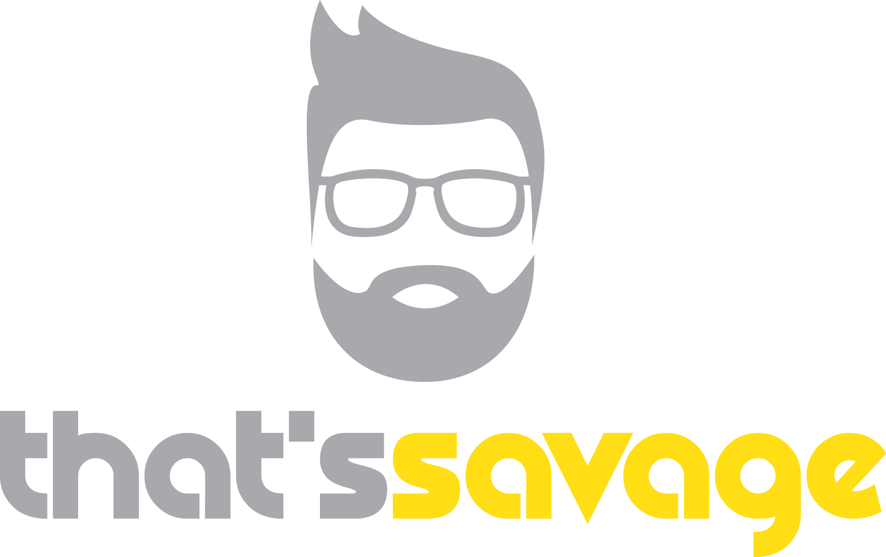

---
<a href="https://thatssavage.ie/" style="text-decoration: none; color: white">
That's Savage specialise in high quality, custom print garments and logo design. With over 10 years experience in design and garment printing, we are confident that we can supply a tailor made print to your liking. There are no minimum order requirements meaning that we can print special one off garments while also catering for much larger orders.
</a>

---
## Project
---

- Work-In-Progress. Feedback and Constructive Criticism are appreciated.
- First front-end project built using React and Bootstrap CSS.
- Using React's functionality like Hooks and Components.
- Uses a contact form that sends information to a backend.

---
## Development
---

- **NPM install**: Install libraries like react-bootstrap, react-card-flip, axios etc.
- **NPM start**: Project does not use yarn. Runs on localhost:3000 as default.
- **NPM run deploy**: Uses gh-pages to build the project and deploy on Github with our own domain.

---
## Authors
---

| Authors        | LinkedIn | Github | Contribution                        |   |
|----------------|----------|--------|-------------------------------------|---|
| **Liam Savage**    | [liam-savage](https://www.linkedin.com/in/liam-savage-72b532101) | [LiLiSav](https://github.com/LiLiSav) | Front-end Creator & Deployment      |   |
| **Michael Savage** | [michaelssavage](https://www.linkedin.com/in/michaelssavage) | [michaelssavage](https://github.com/michaelssavage) | Refactoring & [Contact Form Back-end](https://github.com/michaelssavage/thatssavage-form) |   |
|                |          |        |                                     |   |

